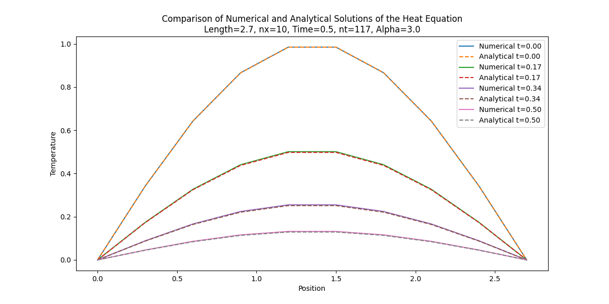

# **Advanced Scientific Visualization & Simulation in Python**

[![Python Version][python-badge]][python-link]
[![License: MIT][license-badge]][license-link]
[![Dependencies][deps-badge]][deps-link]
[![Made with Manim][manim-badge]][manim-link]

This repository presents a curated collection of computational projects that bridge the gap between abstract mathematics and tangible, dynamic visuals. The work herein demonstrates the implementation of advanced numerical methods to solve and visualize complex physical phenomena described by partial differential equations. The capstone of this exploration is a cinematic animation of morphing Turing patterns, rendered with the Manim engine, which connects the emergent complexity of a reaction-diffusion system directly to its governing mathematical parameters.


---
## **Table of Contents**
1.  [Portfolio Overview](#portfolio-overview)
    * [I. Comparative Analysis of the 1D Heat Equation](#i-comparative-analysis-of-the-1d-heat-equation)
    * [II. Cinematic Visualization of Morphing Turing Patterns](#ii-cinematic-visualization-of-morphing-turing-patterns)
    * [III. Interactive UI for 2D Wave Propagation](#iii-interactive-ui-for-2d-wave-propagation)
2.  [Repository Structure](#repository-structure)
3.  [Setup and Installation](#setup-and-installation)
4.  [Usage](#usage)

---
## **Portfolio Overview**

### **I. Comparative Analysis of the 1D Heat Equation**

This module presents a rigorous implementation of a numerical solver for the 1D heat equation, a fundamental PDE in thermal physics:
$$ \frac{\partial w}{\partial t} = \alpha \frac{\partial^2 w}{\partial x^2} $$
A key achievement of this work is the direct, visual comparison between a numerical approximation and the exact analytical solution. This dual approach allows for a precise analysis of the numerical method's accuracy and stability under varying discretization parameters.

<details>
<summary><b>Click to expand In-Depth Methodology</b></summary>

#### **Crank-Nicolson Method**
The numerical solution is achieved through a robust implementation of the **Crank-Nicolson** finite difference scheme. The simulation considers a 1D rod of length $L$ with an initial sinusoidal temperature distribution $w(x,0) = \sin(\frac{\pi x}{L})$ and fixed Dirichlet boundary conditions, $w(0,t) = w(L,t) = 0$.

The discretization of the heat equation using this method is:
$$ -r w_{i-1}^{n+1} + (1 + 2r)w_i^{n+1} - r w_{i+1}^{n+1} = r w_{i-1}^n + (1 - 2r) w_i^n + r w_{i+1}^n $$
with the stencil coefficient $r = \frac{\alpha \Delta t}{2(\Delta x)^2}$. This implicit method is unconditionally stable for all values of $r$.

The linear system can be expressed in matrix form as $A \mathbf{w}^{n+1} = B \mathbf{w}^n$, where $A$ and $B$ are tridiagonal matrices:
$$
A = \begin{pmatrix}
1 & 0 & 0 & \cdots & 0 \\
-r & 1+2r & -r & \cdots & 0 \\
\vdots & \ddots & \ddots & \ddots & \vdots \\
0 & \cdots & -r & 1+2r & -r \\
0 & \cdots & 0 & 0 & 1
\end{pmatrix}
\quad
B = \begin{pmatrix}
1 & 0 & 0 & \cdots & 0 \\
r & 1-2r & r & \cdots & 0 \\
\vdots & \ddots & \ddots & \ddots & \vdots \\
0 & \cdots & r & 1-2r & r \\
0 & \cdots & 0 & 0 & 1
\end{pmatrix}
$$

#### **Analytical Solution**
For validation, the exact analytical solution is derived using a **Fourier sine series**. For the given initial and boundary conditions, the solution is:
$$ w(x,t) = \sin\left(\frac{\pi x}{L}\right) e^{-\alpha \left(\frac{\pi}{L}\right)^2 t} $$
The program calculates this solution on the same grid, providing a direct benchmark for the numerical result.

</details>



### **II. Cinematic Visualization of Morphing Turing Patterns**

This work culminates in a cinematic, presentation-ready animation of Turing pattern formation, rendered via the **Manim Community** engine. The visualization showcases the emergent complexity of the **Gray-Scott reaction-diffusion model**:
$$ \frac{\partial u}{\partial t} = D_u \nabla^2 u - uv^2 + f(1-u) \\ \frac{\partial v}{\partial t} = D_v \nabla^2 v + uv^2 - (f+k)v $$
Here, $\nabla^2$ is the Laplacian operator governing diffusion, $-uv^2$ and $+uv^2$ are the non-linear reaction terms, and $f$ (feed) and $k$ (kill) are the control parameters.

The animation's primary achievement is the demonstration of **pattern morphing**. By smoothly animating the `f` and `k` parameters over time, the system is guided through different regions of its parameter space, causing the visual pattern to dynamically transition between distinct states (e.g., from "Coral" to "Fingerprints"). The governing equations and their real-time parameter values are rendered on-screen, inextricably linking the mathematical abstraction to the evolving artistry of the simulation.

### **III. Interactive UI for 2D Wave Propagation**

To bridge the gap between static code and dynamic exploration, this repository includes an interactive, web-based laboratory for visualizing the 2D wave equation:
$$ \frac{\partial^2 u}{\partial t^2} = c^2 \left( \frac{\partial^2 u}{\partial x^2} + \frac{\partial^2 u}{\partial y^2} \right) $$
Built with **Streamlit**, this application provides an intuitive GUI that grants real-time control over the simulation's core parameters. Users can manipulate wave speed, grid resolution, and initial conditions, and then explore the resulting wave propagation through a time-slider and an interactive 3D plot. This transforms the simulation from a single execution into a powerful exploratory tool.

<details>
<summary><b>Click to expand Mathematical Basis</b></summary>

The visualization is based on the analytical solution to the 2D wave equation on a rectangular membrane with fixed boundaries, derived via separation of variables. The displacement $u(x,y,t)$ is expressed as a double Fourier sine series:
$$ u(x,y,t) = \sum_{m=1}^{\infty} \sum_{n=1}^{\infty} \sin\left(\frac{m\pi x}{L_x}\right) \sin\left(\frac{n\pi y}{L_y}\right) \left( A_{mn} \cos(\omega_{mn} t) + B_{mn} \sin(\omega_{mn} t) \right) $$
where $\omega_{mn} = c\pi \sqrt{\left(\frac{m}{L_x}\right)^2 + \left(\frac{n}{L_y}\right)^2}$ is the angular frequency for each $(m,n)$ mode. The coefficients $A_{mn}$ and $B_{mn}$ are calculated from the initial displacement and velocity of the membrane. The Streamlit app computes a truncated version of this series to generate the 3D surface.

</details>

## **Setup and Installation**

A virtual environment is highly recommended for managing the distinct dependencies of these projects.

1.  **Clone the repository:**
    ```bash
    git clone [https://github.com/your-username/your-repo-name.git](https://github.com/your-username/your-repo-name.git)
    cd your-repo-name
    ```

2.  **Create and activate a virtual environment:**
    ```bash
    python -m venv venv
    # On Windows: .\venv\Scripts\activate
    # On macOS/Linux: source venv/bin/activate
    ```

3.  **Install all required dependencies:**
    ```bash
    pip install numpy matplotlib pytest scipy manim streamlit
    ```
    For Manim to function, you must have external dependencies **FFmpeg** and a **LaTeX** distribution (like MiKTeX) installed on your system.

---
## **Usage**

### **Running the Heat Equation Simulation**
1.  Customize parameters in `configurationA.txt`.
2.  Execute the script: `python simulation.py`

### **Rendering the Reaction-Diffusion Animation**
1.  Open `scene.py` to customize the animation parameters.
2.  Render the video: `manim -pql scene.py MorphingPatternsScene`

### **Launching the Interactive Wave UI**
1.  Launch the Streamlit app: `streamlit run 2d-wave.py`


[python-badge]: https://img.shields.io/badge/Python-3.8+-blue.svg
[python-link]: https://www.python.org/downloads/
[license-badge]: https://img.shields.io/badge/License-MIT-yellow.svg
[license-link]: ./LICENSE
[deps-badge]: https://img.shields.io/badge/dependencies-multi--project-brightgreen.svg
[deps-link]: #setup-and-installation
[manim-badge]: https://img.shields.io/badge/Engine-ManimCE-blueviolet
[manim-link]: https://www.manim.community/
